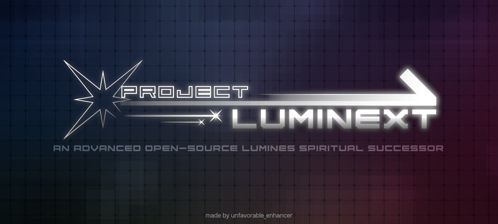

# Project Luminext

  

## Links
**Official discord server (Mods, Development news, Bug-reports, Suggestions, Game discussions and more):**
https://discord.gg/XwsQcEUCKR 

## About
Project Luminext is block-stacking puzzle game where main goal is to build squares from same-colored blocks, which soon gets erased by music engaged timeline. More squares you build, more score you'll get!

Currently project in pretty early stage of development but already includes many cool features such as:

- **Skin Editor** - very easy to use and finally allows anyone to make and share skins they dreamed about!
- **Playlist mode** - put more than *10* skins into single playlist and save it!
- **60/120/180/300/600 sec Time attack mode** - with 5 disciplines to beat records in and a lot of nerdy graphs and statistics of your results! 
- **Synthesia mode** - put your own music and play it with funky visualizer!
- **6 Brand new original skins included** - made with giant help of our community members!
- **7 Special blocks and 4 color mode!** - *just for fun!*

In future there's gonna be a lot more skins/gamemodes and features added, so any help with development process would be highly appreciated.

### DISCLAIMER
*Project Luminext has no relationship with Lumines™ series and wasn't endorsed by it's respective owners: Enhance, Resonair and BNEI, nor any of their affiliates.
We're not intending to replace original series and please, if you want real Lumines™ remake, check out [Lumines Remastered](https://luminesremastered.com) instead.*

## Contribution
There are several ways to contribute to the Luminext project:

### Bug reporting and suggestions
You can make bug reports or suggestions by pulling an issue.

If you don't have a GitHub account, but have a Discord account, you can do an bug report or suggestion in appropriate channels in our **official Discord server.**

Other cases like emails, comments and etc. aren't recommended since they could be easily lost under many other messages. 
By using two methods above you not just definetely get listened but help us more.

### Making custom content
Currently the following types of mods are possible to create: *custom skins* and *core mods*

You can find info about making both in our wiki here: *under_construction*

Your finished work should be uploaded to our [official Discord server](https://discord.gg/yTQ6nnHDzR) "mod-release" forum and follow mod publication rules which are also described there.
*Other ways are highly not recommended and we're not taking any responsibility for them.*

### Contribution to source code, assets
You could help us fixing bugs/issues or do more complex stuff via pull-requests.
Design doc and development plan are currently *under construction* but soon would be avaiable for anyone to look.

All source code contributors, would get an special discord role and get credited in repo "CREDITS.txt" file and in-game credits screen.

## Building
To run the project you only need to download standard [Godot Engine 4.3 (without C# support)](https://godotengine.org/download)
For skin custom scenery making purposes I recommend to use my build of Godot Engine 4.3 editor, which fixes animation snapping bug. [You can download it here.](https://github.com/UnfavorableEnhancer/godot)

Then you can just drag & drop cloned project folder to godot project manager and you're ready to go!

*Note: Online leaderboards aren't avaiable in cloned project due to missing plugin and API key. Project uses SilentWolf plugin for online leaderboards and it currently has undefined license, so we can't include it here. Only official builds feature online leaderboards.*

Currently those platfroms are supported:
- Windows - To change exported game exe icon and metadata you'll need to use WindowsSDK rcedit.exe or Resource Hacker.
- Linux - Nothing special, but currently only x86_64 builds are made.

There are also some things which may require additional software to work with:
- Krita 5.1.5+ - Used to access some graphical assets sources (with .kra extension)

## License
Luminext is GNU AGPL V3.0 licensed project. You can read license in "COPYING.txt".

Fonts, addons and third party applications are covered by different licenses. You can check them in respective folders.

All original images, sound effects and their avaiable assets are under [CC BY 4.0](https://creativecommons.org/licenses/by-nc/4.0/legalcode.txt) license.
All included skins assets rights belongs to their respective authors.

Project Luminext © 2024 by unvaforable_enhancer